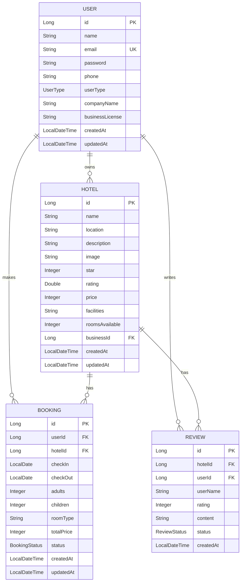

# LuxuryStay - 精品酒店预订平台 - 项目文档

## 1. 项目概述

### 1.1 项目名称
LuxuryStay - 精品酒店预订平台

### 1.2 项目定位
打造一个高端、优雅的精品酒店预订平台，为用户提供沉浸式的视觉体验和流畅的预订流程。支持普通用户预订酒店、酒店商家管理酒店和评论。

### 1.3 目标用户
- 追求高品质住宿体验的高端客户
- 商务差旅人士
- 度假旅游者
- 酒店商家

## 2. 功能需求

### 2.1 核心功能模块

| 模块 | 功能描述 | 优先级 |
|------|----------|--------|
| 用户认证 | 用户/商家注册、登录、退出 | P0 |
| 酒店搜索 | 目的地搜索、日期选择、人数选择（含儿童）、筛选 | P0 |
| 酒店展示 | 酒店列表、详情页、价格、评分、设施 | P0 |
| 预订管理 | 创建预订、查看订单、取消订单 | P0 |
| 用户评价 | 发表评价、查看评价、评价审核 | P1 |
| 商家管理 | 酒店管理、评论管理 | P1 |
| 个人中心 | 用户信息、订单管理 | P1 |

### 2.2 交互需求
- **响应式设计**：支持桌面端、平板、手机端自适应
- **表单验证**：实时表单验证和错误提示
- **状态反馈**：操作成功/失败提示

## 3. 技术选型

### 3.1 整体架构
采用 Spring Boot 单体应用架构，使用 Thymeleaf 进行服务端渲染。

### 3.2 后端技术栈

```
框架：Spring Boot 3.2.x
Java 版本：Java 21
构建工具：Maven
数据库：SQLite
ORM：Spring Data JPA + Hibernate
视图模板：Thymeleaf
安全：Spring Security + JWT
日志：SLF4J + Logback
```

### 3.3 项目结构

```
luxury-stay-backend/
├── src/
│   └── main/
│       ├── java/
│       │   └── com/example/luxurystay/
│       │       ├── LuxuryStayApplication.java
│       │       ├── config/
│       │       │   ├── SecurityConfig.java
│       │       │   ├── GlobalExceptionHandler.java
│       │       │   └── DataInitializer.java
│       │       ├── controller/
│       │       │   ├── HomeController.java
│       │       │   ├── AuthController.java
│       │       │   ├── HotelController.java
│       │       │   ├── BookingController.java
│       │       │   └── ReviewController.java
│       │       ├── service/
│       │       │   ├── UserService.java
│       │       │   ├── HotelService.java
│       │       │   ├── BookingService.java
│       │       │   ├── ReviewService.java
│       │       │   └── JwtService.java
│       │       ├── repository/
│       │       │   ├── UserRepository.java
│       │       │   ├── HotelRepository.java
│       │       │   ├── BookingRepository.java
│       │       │   └── ReviewRepository.java
│       │       ├── entity/
│       │       │   ├── User.java
│       │       │   ├── UserType.java
│       │       │   ├── Hotel.java
│       │       │   ├── Booking.java
│       │       │   ├── BookingStatus.java
│       │       │   ├── Review.java
│       │       │   └── ReviewStatus.java
│       │       └── dto/
│       │           ├── LoginRequest.java
│       │           ├── RegisterRequest.java
│       │           ├── JwtResponse.java
│       │           ├── ApiResponse.java
│       │           ├── HotelRequest.java
│       │           ├── BookingRequest.java
│       │           └── ReviewRequest.java
│       └── resources/
│           ├── application.yml
│           └── templates/
│               ├── index.html
│               ├── login.html
│               ├── register.html
│               ├── hotel-detail.html
│               ├── search.html
│               ├── business.html
│               └── profile.html
└── pom.xml
```

## 4. 数据库设计

### 4.1 实体关系图



## 5. API 接口设计

### 5.1 认证接口

| 方法 | 路径 | 描述 |
|------|------|------|
| POST | /auth/login | 用户登录 |
| POST | /auth/register | 用户注册 |
| GET | /auth/logout | 用户退出 |

### 5.2 酒店接口

| 方法 | 路径 | 描述 |
|------|------|------|
| GET | /hotels | 获取所有酒店 |
| GET | /hotels/search | 搜索酒店 |
| GET | /hotels/{id} | 获取酒店详情 |
| POST | /hotels | 创建酒店（商家） |
| PUT | /hotels/{id} | 更新酒店 |
| DELETE | /hotels/{id} | 删除酒店 |

### 5.3 预订接口

| 方法 | 路径 | 描述 |
|------|------|------|
| GET | /bookings/user | 获取用户订单 |
| POST | /bookings | 创建预订 |
| DELETE | /bookings/{id} | 取消预订 |

### 5.4 评论接口

| 方法 | 路径 | 描述 |
|------|------|------|
| GET | /reviews/hotel/{hotelId} | 获取酒店评价 |
| POST | /reviews | 提交评价 |
| PUT | /reviews/{id}/approve | 审核通过评价 |
| PUT | /reviews/{id}/reject | 拒绝评价 |

## 6. 部署说明

### 6.1 环境要求
- Java 21+
- Maven 3.8+

### 6.2 启动方式

```bash
cd luxury-stay-backend
mvn spring-boot:run
```

### 6.3 访问地址
- 首页：http://localhost:8080
- API 文档：http://localhost:8080/swagger-ui.html

## 7. 测试账号

| 用户类型 | 邮箱 | 密码 |
|----------|------|------|
| 管理员 | admin@example.com | 123456 |
| 普通用户 | user@example.com | 123456 |
| 商家用户 | business@example.com | 123456 |

## 8. 功能清单

- ✅ 用户注册（支持普通用户/酒店商家）
- ✅ 用户登录
- ✅ 酒店搜索
- ✅ 酒店详情展示
- ✅ 酒店预订（支持儿童选择）
- ✅ 用户评价（待审核机制）
- ✅ 商家管理页面
- ✅ 个人中心
- ✅ 数据持久化（SQLite）
